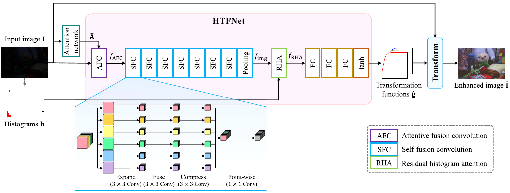

# HTF-Net [2022 ICIP]

### Jaemin Park, An Gia Vien, Jin-Hwan Kim, and Chul Lee
## Official pytorch implementation for **"Histogram-based transformation function estimation for low-light image enhancement,"** in Proc. **IEEE International Conference on Image Processing (ICIP)**, Bordeaux, France, Oct. 2022, pp. 1–5.<br/>
[Paper](https://ieeexplore.ieee.org/abstract/document/9897778?casa_token=Jx-JhbzdyPsAAAAA:_4tgNyj87FvOt5Vu4CNuj0wxI34ddVmb78_xxUhCuLo_ImwIryi4CNoFcEI-gW8kXw-rGkK68sJZ9Q)


<p float="left">
  &emsp;&emsp; 
</p>


You can train and test the algorithm by running **lowlight_train.py** and **lowlight_test.py**.

## Training data path
1. Input images: ./data/train_data/input
2. Ground-truth: ./data/train_data/gt

Do not generate ./data/train_data/curves.<br/>
When you first train the algorithm, ./data/train_data/curves will be generated automatically.<br/>
Then, the ground-truth transformation functions for training will be automatically calculated and saved on ./data/train_data/curves.<br/>
Note that the input image and corresponding ground-truth files must have the same file name.<br/>
Trained attention network and HTF-Net weights(.pth file) will be saved as 'models/att_final.pth' and 'models/Img_final.pth', respectively. 

## Test data path
1. Input images: ./data/test_data/[your folder]
2. Ground-truth: ./data/test_gt/[your folder]

## Citation
If you find this work useful for your research, please consider citing our paper:
```
@inproceedings{Park2022HTFNet,
  title={Histogram-based transformation function estimation for low-light image enhancement},
  author={Park, Jaemin and Vien, An Gia and Kim, Jin-Hwan and Lee, Chul},
  booktitle={2022 IEEE International Conference on Image Processing (ICIP)},
  pages={1--5},
  year={2022},
  organization={IEEE}
}
```

## License
See [MIT License](https://github.com/PJaemin/HTF-Net/blob/main/LICENSE)


